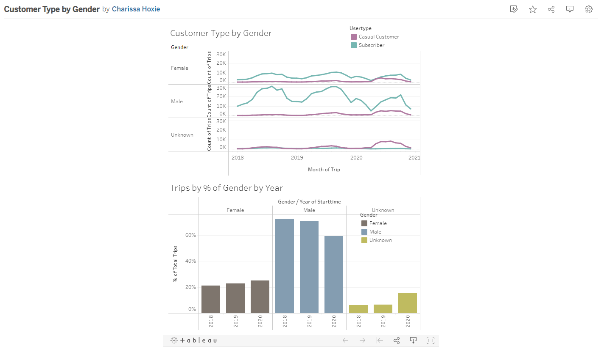

# Citi Bike Analytics

## Background

Looking at data from January 2018 through December 2020, I looked at the types of customers, the gender and age of customers, and popular stations for starting and ending trips. My tableau story can be found [here](https://public.tableau.com/app/profile/charissa.hoxie/viz/CitiBikeStory_16328049582700/Story1).

### Customer Types

There are two categories of customers, casual and subscribers. There are far more subscribers than there are casual customers, sometimes almost 10 times as much. Starting in April of 2020, both types dropped lower than they had in previous years, probably due to COVID shutdowns. Although when the numbers started to climb in May 2020 the gap between casual customers and subscribers were not nearly as great. My thoughts on this are possibly that people may not have known how long things would stay shut down so they didn't want to become a subscriber. Also with shut downs there are far less cars on the roads and people may have been more comfortable riding bikes. 

While the subscribers greatly outnumber the casual customers, the averaage trip duration for casual customers is far greater than the average for subscribers. The average trip duration for subscribers is less than 10 minutes, while the average for casual customers hardly drops below 40 minutes. Again, there was a change starting in April 2020 and the average trip duration for subscribers climbed to 20 minutes at it's peak, staying above 10 minutes through 2020. 

Another observation is that the subscriber count decreases from December through February, most like due to the harsher weather conditions. Casual customers also drop during this time period, though not as dramatically.

My tableau customer dashboard can be found [here](https://public.tableau.com/app/profile/charissa.hoxie/viz/CustomerByTypeAnalysis/CustomerTypeAnalysis).

 

### Gender

The customer base is largely male, with males accounting for over 70% of trips in 2018 and 2019. There was a 10% decrease in 2020, however, there was a 10% increase in unknown by about the same. Over the past three years there has been a total of a 4% increase of female customers. There was a larger increase in 2020, and releated to the above I wonder if females found it safer with COVID shutdowns and less vehicles on the road. This metric is not something that is currently being tracked, which is unforunate as I think it is a metric that should be looked at.

My tableau gender dashboard can be found [here](https://public.tableau.com/app/profile/charissa.hoxie/viz/CustomerTypeByGender/GenderAnalysis).

### Popular Locations

The same stations are similarly busy whether the trips are started or ended. During the summer months the activity is more spreadout between the stations, and during the winter the busy stations really stand out. Starting in April 2020 there was a lot more activity in some of the otherwise less busy stations. I think that correlates to the other data from after COVID shutdowns.

My tableau map dashboard can be found [here](https://public.tableau.com/app/profile/charissa.hoxie/viz/PopularStartandStopLocations/PopularStartandStopLocations).

